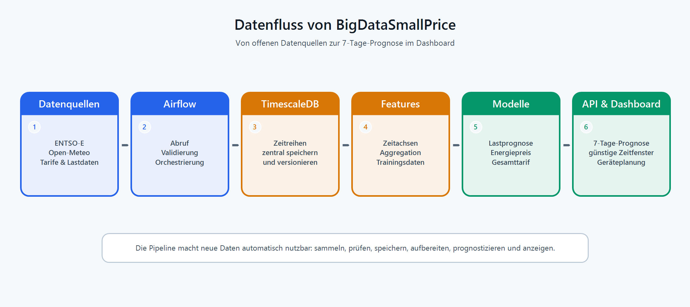

# Strom sparen mit Daten: Wann ist Strom in Winterthur günstig?

Die Waschmaschine läuft, das E-Auto lädt, die Wärmepumpe springt an. Für viele Haushalte spielt es heute kaum eine Rolle, wann genau Strom verbraucht wird. Mit dynamischen Stromtarifen ändert sich das: Strom kann je nach Tageszeit, Netzbelastung und Marktsituation deutlich günstiger oder teurer sein. Wer den richtigen Zeitpunkt kennt, kann Kosten sparen und gleichzeitig das Stromnetz entlasten.

Genau hier setzt unser Projekt **BigDataSmallPrice** an. Im Rahmen des Moduls PM4 an der ZHAW School of Engineering haben wir eine Plattform entwickelt, die dynamische Stromtarife für Winterthur prognostiziert. Unsere Leitfrage war einfach formuliert, technisch aber anspruchsvoll: **Wie genau lässt sich vorhersagen, wann Strom in Winterthur in den nächsten Tagen günstig oder teuer wird?**

Kurz gesagt: Wir verbinden öffentliche Strommarkt-, Wetter-, Tarif- und lokale Lastdaten, trainieren daraus Machine-Learning-Modelle und zeigen die Resultate in einem Dashboard. Aus abstrakten Zeitreihen wird damit eine praktische Frage beantwortbar: **Soll ein Gerät jetzt laufen oder lieber später?**

## Was man nach dem Lesen weiss

- warum dynamische Stromtarife eine Prognose brauchen
- welche Datenquellen für eine lokale Strompreisvorhersage zusammenkommen
- weshalb wir zwei Modelle statt einer einzigen Blackbox gebaut haben
- wie gut die Prognose im Test funktioniert hat
- was wir aus Datenqualität, Automatisierung und Modellwahl gelernt haben

## Warum dynamische Tarife Planung brauchen

Dynamische Tarife bestehen nicht nur aus einem einzigen Preis. Für Endkundinnen und Endkunden zählt am Ende der Gesamttarif in Rappen pro Kilowattstunde. Dieser setzt sich vereinfacht aus zwei Teilen zusammen:

- dem Energiepreis, der stark vom europäischen Day-Ahead-Strommarkt beeinflusst wird
- dem Netzpreis, der von der lokalen Netzlast abhängt

Der Energiepreis reagiert unter anderem auf Produktion, Nachfrage, Wind, Sonne und grenzüberschreitende Marktbewegungen. Der Netzpreis hängt stärker davon ab, wie stark das lokale Netz zu einem bestimmten Zeitpunkt belastet wird. Für Haushalte ist beides relevant: Ein günstiger Marktpreis hilft wenig, wenn gleichzeitig das Netz stark belastet ist.

Im Alltag entsteht daraus ein konkretes Beispiel: Wenn das E-Auto nicht sofort voll sein muss, kann es in einem günstigen Zeitfenster laden. Dasselbe gilt für Geräte wie Waschmaschine, Geschirrspüler oder Wärmepumpe. Eine reine Anzeige historischer Preise reicht dafür nicht. Nützlich wird der Tarif erst, wenn er als Prognose vorliegt und in verständliche Zeitfenster übersetzt wird.

## Von Rohdaten zur Tarifprognose

Um beide Tarifkomponenten prognostizieren zu können, verbindet BigDataSmallPrice acht Datenquellen. Dazu gehören Day-Ahead-Preise und Lastdaten der ENTSO-E Transparency Platform, Wetterdaten von Open-Meteo, hydrologische Daten des BAFU, Tarifdaten von EKZ, CKW und Groupe E sowie offene Last- und PV-Daten von Stadtwerk Winterthur.

Diese Daten kommen in unterschiedlichen Formaten, Auflösungen und Zeitzonen. Einige Quellen liefern stündliche Werte, andere Viertelstundenwerte, wieder andere Tageswerte. Im Projekt verarbeiten wir unter anderem REST/JSON, REST/XML, CSV, Parquet, HTML und manuell dokumentierte Tarifformeln. Deshalb war ein grosser Teil der Arbeit keine Modellierung im engeren Sinn, sondern saubere Datenarbeit: abrufen, prüfen, vereinheitlichen, speichern und für Machine-Learning-Modelle aufbereiten.

*Die Plattform verarbeitet Markt-, Wetter-, Tarif- und Lastdaten zu einer automatisierten Strompreisprognose.*

Die Pipeline läuft über Apache Airflow. Rohdaten werden in TimescaleDB gespeichert, einer PostgreSQL-Erweiterung für Zeitreihendaten. Aktuell umfasst die Datenbank rund **1,5 Millionen Zeitreihenpunkte**. Allein der Winterthurer Bruttolastgang enthält rund **462'000 Viertelstundenwerte** aus 13 Jahren. Daraus entstehen Feature-Views und Parquet-Exporte für das Training.

Diese Architektur war für uns wichtig, weil sie das Projekt reproduzierbar macht: Neue Daten können automatisch nachgeladen werden, Modelle lassen sich erneut trainieren und die API greift auf klar definierte Datenprodukte zu.

## Zwei Modelle statt einer Blackbox

Wir haben die Prognose bewusst in zwei Teilprobleme aufgeteilt. **Modell A** prognostiziert die lokale Nettolast in Winterthur. Dafür nutzt es unter anderem Kalendermerkmale, Wetterprognosen, Feiertage sowie Lastwerte von gestern und von der Vorwoche. Aus der prognostizierten Netzlast wird anschliessend ein dynamischer Netzpreis berechnet.

**Modell B** prognostiziert den EPEX-Day-Ahead-Preis für die Schweiz. Neben vergangenen Strompreisen fliessen Wetterdaten, Lastprognosen, Produktionsdaten und internationale Einflussgrössen ein. Besonders spannend war dabei der Blick über die Schweizer Grenze: Wind in Norddeutschland kann den zentraleuropäischen Strommarkt stark beeinflussen und damit auch die Schweizer Preise bewegen.

Warum diese Trennung? Weil der Stromtarif nicht aus einer einzigen Ursache entsteht. Das lokale Netz und der internationale Strommarkt folgen unterschiedlichen Logiken. Zwei spezialisierte Modelle sind deshalb verständlicher, besser prüfbar und leichter weiterzuentwickeln als ein einziges Modell, das alles gleichzeitig erklären müsste.

Für beide Modelle haben wir verschiedene Verfahren getestet, darunter naive Baselines, lineare Modelle, LSTM, Transformer-Varianten und XGBoost. Am Ende überzeugte XGBoost am meisten: Es trainiert schnell, kommt gut mit tabellarischen Zeitreihendaten zurecht und lieferte in unserem Setup robuste Resultate. Für die Lastprognose war auch ein lineares Modell überraschend stark, was zeigt, dass Tageszeit, Wochentag und Temperatur bereits viel Struktur erklären.

## Was kam heraus?

Die Ergebnisse zeigen, dass sich dynamische Stromtarife mit öffentlich verfügbaren Daten gut prognostizieren lassen. Im Test erreichte das Lastmodell einen mittleren prozentualen Fehler von **3,99 Prozent**. Das Energiepreismodell lag bei **7,72 Prozent**. Einfach gesagt: Die Modelle lagen im Durchschnitt nur wenige Prozent neben den später beobachteten Werten.

Beide Werte liegen deutlich unter unseren ursprünglichen Qualitätszielen von 8 Prozent für die Lastprognose und 15 Prozent für die Energiepreisprognose. Der API-Endpunkt liefert daraus eine 7-Tage-Prognose im 15-Minuten-Raster. Das sind **672 Prognosepunkte** pro Abruf.

.png)

*Das Dashboard visualisiert die prognostizierten Stromtarife und markiert günstige Zeitfenster für verschiedene Geräte.*

Für Nutzerinnen und Nutzer wird aus diesen Daten eine Entscheidungshilfe. Das Dashboard zeigt nicht nur eine Preiskurve, sondern markiert günstige, mittlere und teure Zeitfenster. So lässt sich zum Beispiel erkennen, wann das Laden eines E-Autos oder der Betrieb einer Waschmaschine besonders sinnvoll ist. Eine Ampellogik macht aus vielen Datenpunkten eine konkrete Empfehlung.

## Big Data im Kleinen

Der Projektname ist mit einem Augenzwinkern gemeint, trifft aber den Kern: Aus vielen kleinen Datenpunkten entsteht ein konkreter Nutzen. Für jeden einzelnen Haushalt geht es vielleicht nur um einige Rappen pro Kilowattstunde. Über viele Geräte, Haushalte und Tage hinweg entsteht daraus aber ein relevantes Potenzial.

Auch aus technischer Sicht war das Projekt ein typischer Big-Data-Anwendungsfall. Nicht weil ein einzelner Datensatz gigantisch wäre, sondern weil viele heterogene Quellen zuverlässig zusammengeführt werden müssen. Die Herausforderung lag in der Kombination aus Datenvolumen, Aktualität, Datenqualität und Automatisierung. Genau diese Mischung macht Energiedaten spannend: Der Wert entsteht erst, wenn Markt-, Wetter-, Last- und Tarifdaten zeitlich sauber zueinander passen.

## Was gut funktionierte

Gut funktioniert hat die Trennung zwischen Datenpipeline, Feature Engineering, Modelltraining und API. Dadurch konnten wir einzelne Teile unabhängig verbessern, ohne das gesamte System umzubauen. TimescaleDB passte sehr gut zum Projekt, weil Zeitreihen direkt mit SQL verarbeitet und aggregiert werden können. Auch XGBoost erwies sich als sinnvoller Kompromiss zwischen Genauigkeit, Trainingszeit und Interpretierbarkeit.

Hilfreich war zudem die klare Unterscheidung zwischen User-Dashboard und Admin-Dashboard. Das User-Dashboard beantwortet die praktische Frage nach günstigen Zeitfenstern. Das Admin-Dashboard zeigt dagegen Datenbankstatus, Modellmetriken, Airflow-Läufe und Datenfrische. So konnten wir nicht nur Prognosen anzeigen, sondern auch prüfen, ob die Grundlage dafür aktuell und plausibel ist.

## Was schwierig war

Am meisten Aufwand verursachte Apache Airflow. Die tägliche Orchestrierung ist mächtig, aber die korrekte Abstimmung von ETL-, Feature-, Backfill- und Trainingsläufen war anspruchsvoller als erwartet. Besonders bei historischen Nachladeprozessen mussten wir sicherstellen, dass keine inkonsistenten Zwischenstände entstehen.

Auch die Datenquellen waren nicht immer so stabil, wie es in einer idealen Architekturzeichnung aussieht. API-Limits, fehlende Werte, verspätete Veröffentlichungen und unterschiedliche Zeitraster beeinflussten die Arbeit stark. Die EKZ-Validierung war zeitweise eingeschränkt, weil nicht alle Rate-Limits vollständig dokumentiert waren. Hydrologische Daten des BAFU lieferten in unserem Setup keinen messbaren Zusatznutzen, weil sie für eine Day-Ahead-Prognose zu spät oder zu grob verfügbar waren.

## Was wir gelernt haben

Die wichtigste Erkenntnis: Gute Prognosen beginnen nicht beim Modell, sondern bei der Datenpipeline. Ein präzises Modell hilft wenig, wenn Eingangsdaten fehlen, falsch ausgerichtet sind oder unbemerkt in unterschiedlichen Zeitzonen vorliegen. Datenqualität, Monitoring und reproduzierbare Exporte waren deshalb genauso wichtig wie das eigentliche Training.

Eine zweite Erkenntnis betrifft die Modellwahl. Komplexere Modelle sind nicht automatisch besser. LSTM und Transformer schnitten zwar solide ab, brauchten aber deutlich mehr Trainingszeit und erreichten nicht die Genauigkeit von XGBoost. Für strukturierte Energiedaten mit begrenzter Datenmenge war ein robustes Gradient-Boosting-Modell die pragmatischere Wahl.

Und drittens: Eine gute Prognose ist nur dann nützlich, wenn sie verständlich angezeigt wird. Für die meisten Nutzerinnen und Nutzer ist nicht entscheidend, wie ein Modell intern arbeitet. Entscheidend ist, ob sie im Alltag erkennen können, wann ein Gerät sinnvollerweise laufen sollte.

## Ausblick

BigDataSmallPrice ist als Projektplattform entstanden, zeigt aber ein reales Anwendungsszenario. Denkbar wären Erweiterungen auf weitere Schweizer Netzgebiete, eine direkte Anbindung an steuerbare Geräte oder eine automatische Planung von Lade- und Betriebszeiten. Besonders spannend wäre auch eine laufende Aktualisierung mit Echtzeitdaten, damit Prognosen im Tagesverlauf präziser werden.

Dynamische Stromtarife machen den Strommarkt für Endkundinnen und Endkunden flexibler, aber auch komplexer. Unser Projekt zeigt: Mit offenen Daten, sauberer Datenarchitektur und Machine Learning lässt sich diese Komplexität in konkrete Handlungsempfehlungen übersetzen.

## Quellen und Links

- Projekt-Repository: https://github.com/BDP26/BigDataSmallPrice
- ENTSO-E Transparency Platform: https://transparency.entsoe.eu
- Open-Meteo: https://open-meteo.com
- BAFU Hydrologie-Datenservice: https://www.bafu.admin.ch
- EKZ dynamische Tarife: https://www.ekz.ch
- TimescaleDB: https://www.timescale.com
- XGBoost: https://xgboost.ai

**Projekt:** BigDataSmallPrice  
**Team:** Ryan Bachmann, Miguel Dinis Silva, Gian Ruchti  
**Kontext:** PM4, ZHAW School of Engineering
